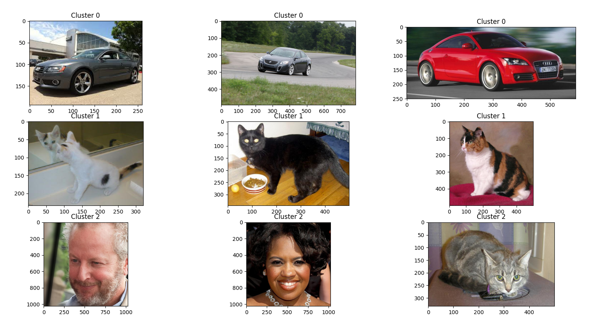

# pytorch-image-grouping

Cluster, visualize similar images, get the file path associated with each cluster. This is just for learning purposes and likely will not work good on image classes that are similar.


## Image




## Output

```
{
    "1":[
        [
            "scattered_images\\82.jpg"
        ],
        [
            "scattered_images\\169127.jpg"
        ],
        [
            "scattered_images\\170154.jpg"
        ],
        [
            "scattered_images\\000135.jpg"
        ],
        [
            "scattered_images\\059816.jpg"
        ],
        [
            "scattered_images\\81.jpg"
        ],
        [
            "scattered_images\\144317.jpg"
        ],
        [
            "scattered_images\\83.jpg"
        ],
        [
            "scattered_images\\002632.jpg"
        ]
    ],
    "0":[
        [
            "scattered_images\\79.jpg"
        ],
        [
            "scattered_images\\78.jpg"
        ],
        [
            "scattered_images\\80.jpg"
        ]
    ],
    "2":[
        [
            "scattered_images\\01821.jpg"
        ],
        [
            "scattered_images\\02185.jpg"
        ],
        [
            "scattered_images\\00970.jpg"
        ],
        [
            "scattered_images\\02467.jpg"
        ],
        [
            "scattered_images\\03555.jpg"
        ],
        [
            "scattered_images\\02244.jpg"
        ]
    ]
}
```


## TODO

- Write clustered data to file.
- Clean, organize code.
- Speedup code, try batching, approximate nn, clustering, different layer features.
